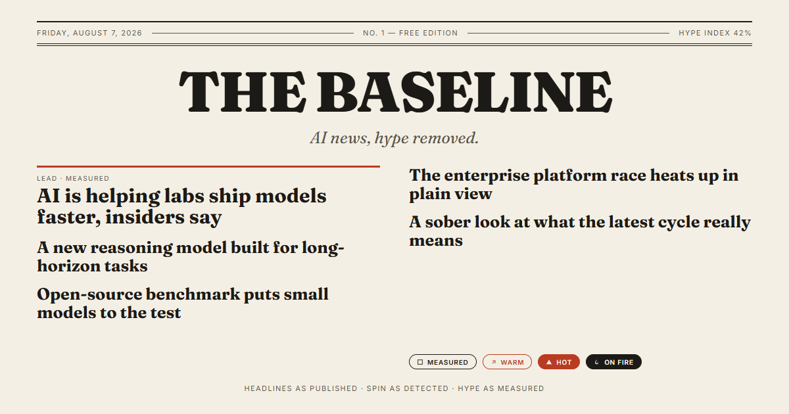

# The Baseline

**AI news, hype removed.**

A free, editorial-print AI news site that aggregates RSS from the AI industry and its chroniclers — verbatim. Headlines as published, spin as detected, hype as measured. No AI-generated content anywhere.



Live site: https://the-baseline.baseline-news.workers.dev

---

## Features

- **Live RSS aggregation** — fetches 10 AI feeds in the browser, fresh on every load.
- **Hype Index** — a print-style gauge showing what share of today's stories are "enthusiastic."
- **Spin scale** — every story is scored Measured → Warm → Hot → On Fire by a heuristic detector.
- **Filter chips** — filter the edition by hype level with live per-bucket counts.
- **Editorial print design** — serif masthead, paper texture, light/dark themes, no WebGL or experimental APIs.
- **Progressive rendering** — stories stream in as each feed resolves; a slow feed never holds the front page.
- **Accessible** — keyboard-navigable modal with a focus trap, ARIA-metered hype gauge, reduced-motion support, color-blind-safe spin badges (shape *and* color).
- **SEO-ready** — Open Graph/Twitter/JSON-LD tags, `robots.txt`, `sitemap.xml`, `site.webmanifest`, and a generated 1200×630 OG image.
- **OPML export** — one click to grab every source for your own reader.

## Stack

- **Frontend**: React 19 + Vite + Tailwind CSS 4 (shadcn-style components), static build output into `dist/`.
- **Hosting**: a Cloudflare Worker serves the built app (`env.ASSETS` → `dist/`) and relays feed XML at `/api/feed`.
- **RSS parsing** happens entirely in the browser (the Worker is pure I/O, so the free-tier CPU cap is respected).

## Architecture

This site runs on Cloudflare's free tier, which enforces a sub-millisecond CPU budget per invocation — too small for server-side RSS parsing. So the work is split:

- **Worker** (`src/index.js`): serves the built React app from `dist/` and relays feed XML from an allowlisted set of sources. Pure I/O, trivial CPU.
- **Browser**: fetches each feed through the Worker, parses it with the native `DOMParser`, scores hype, dedupes, and renders the front page. Fresh on every load.

```
Browser ── /api/feed?name=… ──► Worker ──► upstream RSS (allowlist)
   ▲                                   │
   └───────── XML / DOMParser ─────────┘
        parse → score → dedupe → render
```

## Local development

```bash
npm install
npm run dev
```

`npm run dev` builds the React app, then `wrangler dev` serves both the static app and the feed relay locally. The first visit to `/` fetches all feeds in the browser (a few seconds on a cold cache), then renders the front page. Visit `http://localhost:8787` (whatever port `wrangler dev` reports).

For a fast React-only dev loop without the Worker relay (no live feed data):

```bash
npm run dev:react
```

## Tests

```bash
npm test
```

Runs the unit suite with `node --test` (hype scoring, dedupe, RSS parsing, pipeline, and a guard that the local source allowlist matches the Worker's).

## Build

```bash
npm run build
```

Emits the production React app and assets into `dist/`.

## Deploy

### Manual

Requires a free Cloudflare account.

```bash
npm install
npx wrangler login
npm run deploy
```

`npm run deploy` builds the React app, then uploads the Worker and the static assets. The Worker serves both the site and the feed relay on your `workers.dev` URL. No KV namespace is required.

### CI (recommended)

Two GitHub Actions workflows ship with the repo:

- **`deploy.yml`** — builds, tests, and deploys to production on every push to `master`.
- **`preview-deploy.yml`** — deploys a `the-baseline-preview` Worker per pull request and comments the preview URL.

Both need two repository secrets:

| Secret | Value |
| --- | --- |
| `CLOUDFLARE_API_TOKEN` | A token with Workers permissions (Create/Edit) for your account |
| `CLOUDFLARE_ACCOUNT_ID` | Your Cloudflare account ID |

## Project structure

```
src/
  index.js                 # Worker: static assets + /api/feed relay (allowlist)
  main.jsx                 # React entry point
  app/
    App.jsx                # Page: masthead, filters, sections
    styles.css             # Print-style theme tokens (Tailwind v4)
    components/            # HypeMeter, SelectorChips, SpinBadge, StoryFeed
    hooks/                 # useBaselineData, useTheme
    lib/exportOPML.js      # OPML export
  lib/
    feeds.js               # Source allowlist (must match src/index.js)
    hype.js                # Spin-scoring heuristics
    dedupe.js              # Cross-feed dedupe
    pipeline.js            # Compose + score + stats
  components/ui/           # shadcn-style primitives
public/                    # OG image, robots.txt, sitemap, manifest, favicons
test/                      # node --test unit suite
```

## Adding or changing sources

Edit the `SOURCES` array in `src/lib/feeds.js` **and** the `FEEDS` map in `src/index.js` together (they must match — a test checks for drift). Dead feeds are skipped automatically and shown as "down" on the site's Sources list.

## Hype scoring

Heuristics live in `src/lib/hype.js`: hype words, emotion words, ALL CAPS, exclamation marks, emoji, and number-bragging. Score maps to Measured / Warm / Hot / On Fire. It is a detector, not a judge. Mostly.
