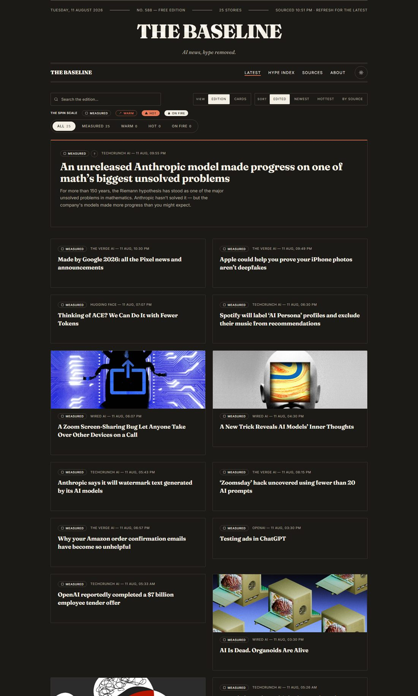
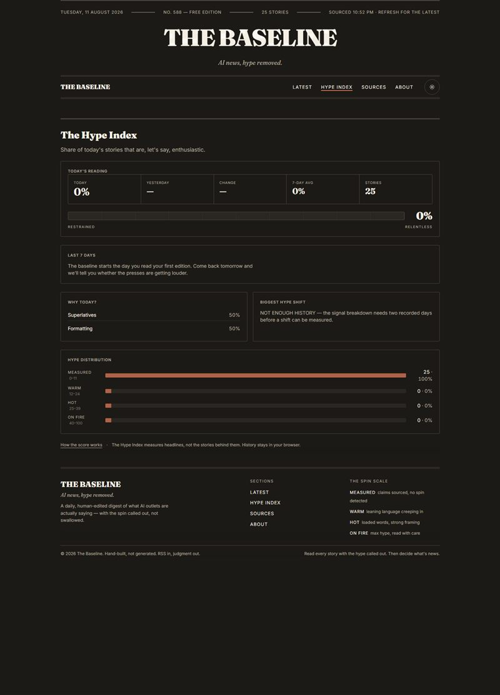
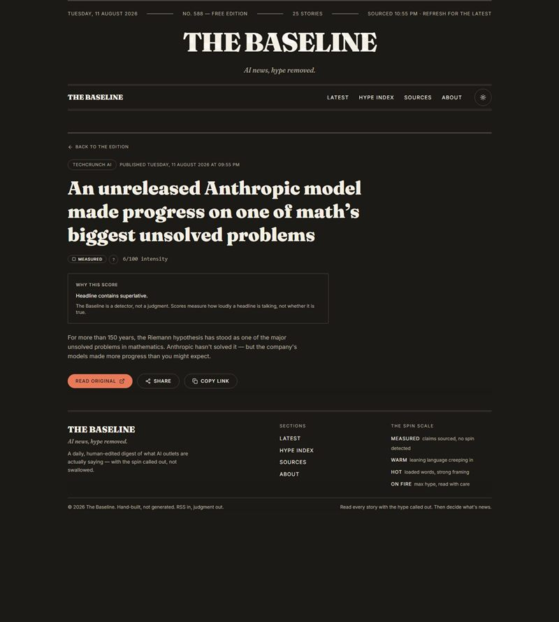
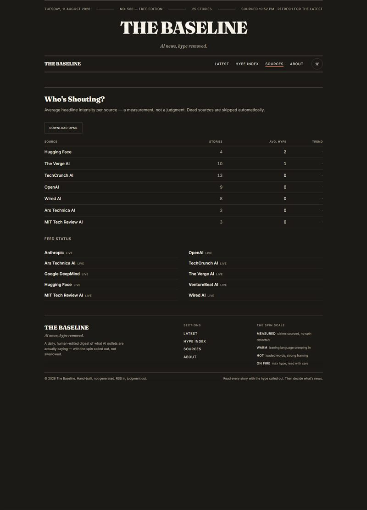
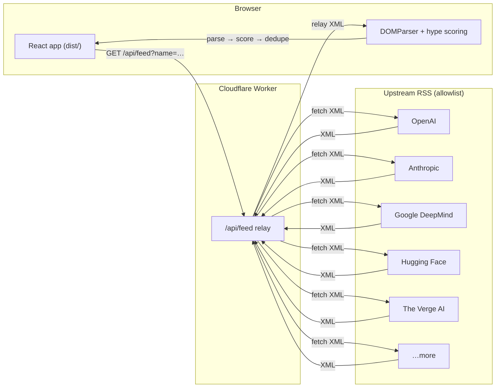
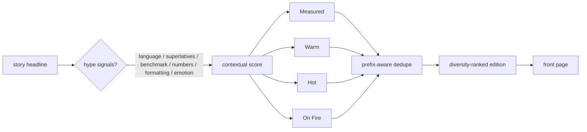

# The Baseline

**AI news, hype removed.**


[](https://github.com/sinzo8771-prog/Baseline/actions/workflows/deploy.yml)

A free, editorial-print AI news site that aggregates RSS from the AI industry and its chroniclers — verbatim. Headlines as published, spin as detected, hype as measured. No AI-generated content anywhere.

**Live site:** <https://the-baseline.baseline-news.workers.dev>

## Screenshots

The front page, printed from the live edition:



The Hype Index gauge, a story page's "Why this score" panel, and the source leaderboard:

| Hype Index | Story | Sources |
| --- | --- | --- |
|  |  |  |

Screenshots are refreshed manually from the live site; the feed-driven pages (story permalinks, hype percentages) naturally vary between captures.

---

## Table of contents

- [Screenshots](#screenshots)
- [Why "hype removed"?](#why-hype-removed)
- [Features](#features)
- [Pages](#pages)
- [Stack](#stack)
- [Architecture](#architecture)
- [Local development](#local-development)
- [Tests](#tests)
- [Build](#build)
- [Deploy](#deploy)
  - [Manual](#manual)
  - [CI (recommended)](#ci-recommended)
- [Project structure](#project-structure)
- [API endpoints](#api-endpoints)
- [Adding or changing sources](#adding-or-changing-sources)
- [Hype scoring](#hype-scoring)
- [Hype Index history](#hype-index-history)
- [Accessibility](#accessibility)
- [Roadmap](#roadmap)

## Why "hype removed"?

Most AI coverage reads like a press release. Every model is "revolutionary", every benchmark is "AGI-adjacent". The Baseline does the opposite of writing news: it *collects* it. Ten RSS feeds from the people doing the work and the people covering it are fetched fresh on every page load, parsed in your browser, scored for spin, deduped across sources, and laid out like tomorrow's paper — with the hype measured, not amplified.

The site never rewrites a headline and generates no content. It is a meter, not a voice.

## Features

- **Live RSS aggregation** — fetches 10 AI feeds in the browser on every load; a slow feed never holds the front page (stories stream in as each feed resolves).
- **Hype Index** — a print-style gauge showing what share of today's stories are "enthusiastic", with **history**: today's reading vs. yesterday, plus a 7-day trend, persisted per-day in your browser.
- **Spin scale** — every story is scored Measured → Warm → Hot → On Fire by a signal-category detector, shown as color-and-shape badges; a `<details>` popover and the story page's "Why this score" panel explain the exact signals behind each score.
- **Methodology** — a dedicated page stating what the score measures, what it does not, and where the detector can be fooled.
- **Search** — filter the edition by any text in a headline, summary, or source name.
- **Source drill-down** — a `?source=` URL filter isolates one outlet, with a one-click "stop filtering" chip, plus `/sources/:name` profile pages.
- **Sorting** — *Edited* (the default news judgment: freshness weighted by hype, with a source-diversity cap so one publisher never owns the front page), *Newest*, *Hottest*, *By Source*.
- **Filter chips** — filter by hype level with live per-bucket counts; search, source, and hype filters compose.
- **Two views** — *Edition* (the print-style list with lead story, glitch headline, and spin badges) and *Cards* (a 21st.dev NewsCards feed where each card's gradient band is keyed to its hype tier).
- **Story permalinks** — `/story/:id` pages with verbatim headline, source, published time, "Why this score", native Share + copy-link, and `NewsArticle` JSON-LD.
- **Resilience** — an in-browser saved edition (SWR-style cache) paints instantly when offline; a "SAVED EDITION · LAST UPDATED" banner offers retry, and every error state has a working "Try the presses again" button.
- **Editorial print design** — serif masthead (with date, edition number, and story count), paper texture, sticky utility nav, light/dark themes, subtle canvas flourishes (VHS footer, reveal effects) that respect reduced motion.
- **SEO-ready** — per-route title/description/canonical, Open Graph / Twitter / JSON-LD tags, `robots.txt`, `sitemap.xml`, `site.webmanifest`, and a generated 1200×630 OG image.
- **OPML export** — one click to grab every source for your own reader.
- **Crash-proofing** — a root `<ErrorBoundary>` catches render errors and prints a "STOP THE PRESSES" recovery screen instead of a blank page.

## Pages

| Route | Page |
| --- | --- |
| `/` | **Home** — the edition: lead story, search, hype filter chips, sort control, Edition/Cards view toggle |
| `/hype-index` | **Hype Index** — today's gauge, spin distribution with percentages, WHY TODAY?, biggest hype shift, 7-day trend |
| `/sources` | **Sources** — the ten feeds with live status, "Who's Shouting?" leaderboard, OPML export |
| `/sources/:name` | **Source profile** — status, story count, avg intensity, distribution, trend, latest stories |
| `/story/:id` | **Story** — verbatim headline, source, published time, Hype score, "Why this score", Share/Copy, original link |
| `/methodology` | **Methodology** — the scoring method, what is not counted, and the detector's limits |
| `/about` | **About** — the editorial stance |
| `*` | **404** — a themed dead-end |

## Stack

- **Frontend**: React 19 + Vite + Tailwind CSS 4 (shadcn-style primitives), `react-router-dom` for routing, `framer-motion` for motion, `lucide-react` for icons. Static build output into `dist/`.
- **Hosting**: a Cloudflare Worker serves the built app (`env.ASSETS` → `dist/`) and relays feed XML at `/api/feed` (with a source list at `/api/feeds`).
- **RSS parsing** happens entirely in the browser (the Worker is pure I/O, so the free-tier CPU cap is respected).

## Architecture

This site runs on Cloudflare's free tier, which enforces a sub-millisecond CPU budget per invocation — too small for server-side RSS parsing. So the work is split:

- **Worker** (`src/index.js`): serves the built React app from `dist/`, lists sources, and relays feed XML from an allowlisted set. Pure I/O, trivial CPU. CORS is locked to its own origin so it can't be used as an open proxy, upstream responses are capped at 1 MB, and `/api/feeds` + `/api/feed` are rate-limited per IP (90 req / 60 s, fails open).
- **Browser**: fetches each feed through the Worker, parses it with the native `DOMParser`, scores hype by signal category, dedupes across feeds (prefix-aware), ranks the edition with a source-diversity cap, and renders. Fresh on every load.



A note on the feeds: several publishers block Cloudflare's egress IPs as bots, so the Worker relays with a real browser User-Agent; Anthropic publishes no RSS, so its feed comes from an hourly-updated GitHub mirror.

## Local development

Requires **Node.js 18+** (the Vite 6 and Wrangler 4 toolchain). No Cloudflare account is needed to run locally.

```bash
npm install
npm run dev
```

`npm run dev` builds the React app, then `wrangler dev` serves both the static app and the feed relay locally. The first visit to `/` fetches all feeds in the browser (a few seconds on a cold cache), then renders the front page. Visit `http://localhost:8787` (whatever port `wrangler dev` reports).

For a fast React-only dev loop without the Worker relay (no live feed data):

```bash
npm run dev:react
```

## Tests

```bash
npm test
```

Runs the unit suite with `node --test`: hype scoring (signal categories + false positives), cross-feed dedupe (prefix + punctuation variants), RSS parsing, pipeline composition, edition ranking (freshness, diversity, hype), Hype Index history, and a guard that the browser-side source allowlist matches the Worker's.

## Build

```bash
npm run build
```

Emits the production React app and assets into `dist/`.

## Deploy

### Manual

Requires a free Cloudflare account.

```bash
npm install
npx wrangler login
npm run deploy
```

`npm run deploy` builds the React app, then uploads the Worker and the static assets. The Worker serves both the site and the feed relay on your `workers.dev` URL. No KV namespace or bindings are required.

### CI (recommended)

Two GitHub Actions workflows ship with the repo:

- **`deploy.yml`** — builds, tests, and deploys to production on every push to `master`.
- **`preview-deploy.yml`** — deploys a `the-baseline-preview` Worker per pull request and comments the preview URL.

Both need two repository secrets:

| Secret | Value |
| --- | --- |
| `CLOUDFLARE_API_TOKEN` | A token with Workers permissions (Create/Edit) for your account |
| `CLOUDFLARE_ACCOUNT_ID` | Your Cloudflare account ID |

## Project structure

```
src/
  index.js                 # Worker: static assets, /api/feeds, /api/feed relay (allowlist, rate-limited, body-capped)
  main.jsx                 # React entry point (wraps the app in <ErrorBoundary>)
  app/
    App.jsx                # Shell: SiteNav, masthead (+edition metadata), routes, VHS footer, toasts, useSeo
    styles.css             # Print-style theme tokens (Tailwind v4)
    components/            # SiteNav, SiteFooter, StoryFeed, SpinBadge, SelectorChips,
                           # HypeMeter, EmptyState, ErrorBoundary
    pages/                 # Home, HypeIndex, Sources, SourceProfile, StoryPage, Methodology, About, NotFound
    hooks/                 # useBaselineData, useTheme
    lib/                   # hypeHistory.js, exportOPML.js, copyLink.js
  lib/
    feeds.js               # Source allowlist + browser-side fetch/parse helpers
                           # (must match src/index.js)
    hype.js                # Signal-category spin scoring (with explanations)
    dedupe.js              # Cross-feed dedupe (prefix-aware)
    ranking.js             # Edition ranking (freshness + hype + source diversity)
    pipeline.js            # Compose + score + stats
  components/
    ui/                    # shadcn-style primitives (button, card, badge, …)
    canvasui/              # Glitch, DecryptReveal, VHS, Asciify, RetroDither
public/                    # OG image, robots.txt, sitemap, manifest, favicons, sw.js
test/                      # node --test unit suite
.github/workflows/         # deploy.yml, preview-deploy.yml
```

## API endpoints

The Worker exposes a tiny, same-origin-only API:

| Endpoint | Purpose |
| --- | --- |
| `GET /api/feeds` | JSON list of `{ name, feed }` for every source (cache-control: 5 min + stale-while-revalidate) |
| `GET /api/feed?name=OpenAI` | Relays that source's upstream RSS XML (browser UA, 8 s upstream timeout, 1 MB body cap) |
| `GET /api/news` | Retired — returns a `410` explaining the presses moved into the browser |

CORS is restricted to the Worker's own origin so third parties can't use the relay as a free open proxy. `/api/feeds` and `/api/feed` are additionally rate-limited per IP (90 requests per 60 s, backed by the edge cache, failing open) so the public relay can't be scripted into an abuse target.

Errors are JSON `{ error, message }`:

| Status | Code | Description |
| --- | --- | --- |
| 404 | `unknown_feed` | No feed matches the `name` query param |
| 502 | `upstream HTTP <n>` | Upstream returned a non-2xx status for that feed |
| 504 | `fetch_failed` | Upstream unreachable, timed out (8 s), or returned an oversized body (refused at 1 MB) |
| 429 | `rate_limited` | Per-IP limit exceeded (90 requests / 60 s) |
| 410 | `moved_to_the_browser` | `/api/news` is retired — the presses now print in the browser |

## Adding or changing sources

Edit the `SOURCES` array in `src/lib/feeds.js` **and** the `FEEDS` map in `src/index.js` together (they must match — a test checks for drift). Dead feeds are skipped automatically and shown as "down" on the site's Sources list.

## Hype scoring

Heuristics live in `src/lib/hype.js`: signal categories — language, superlatives, benchmark, numerical, formatting, emotional — scored contextually (hedged research framing halves word weight, quoted words are ignored, money/facts don't fire, per-word stacking is bounded). Score maps to Measured / Warm / Hot / On Fire. It is a detector, not a judge. Mostly.



## Hype Index history

The index only means something with a baseline, so each day's reading is written to `localStorage` (`baseline-hype-history-v1`, capped at 30 days). The Hype Index page then shows **today vs. yesterday** ("63% today, up 8 from yesterday") and a **7-day trend line**. If a previous day is missing — a first visit, a private-mode browser — the delta and trend quietly hide rather than fabricate a story.

## Accessibility

- Keyboard-navigable story modal with a focus trap, Escape to close, and focus restored on close.
- ARIA-metered hype gauge and `role="status"` banners for offline/refreshing states.
- Reduced-motion support across canvas effects, decrypted headlines, and the VHS footer.
- Color-blind-safe spin badges (shape *and* color), AA-safe chip contrast, and `line-clamp`-ed titles that never push the grid.

## Roadmap

Ideas on the press, in rough priority order:

- **Component tests** — a small `@testing-library/react` smoke suite for the story modal's focus trap and route rendering.
- **PWA installability** — a full app-shell service worker with offline install, beyond the current saved-edition cache.
- **Edge-cached feeds** — serve `/api/feed` from the CDN with shorter TTLs to further cut upstream load.
- **Own combined feed** — a `/feed.xml` of the deduped, scored edition for subscribers (needs a scheduled Worker writing to KV; deliberately not built while the site stays KV-free).

---

*Verbatim in, hype measured out.*
